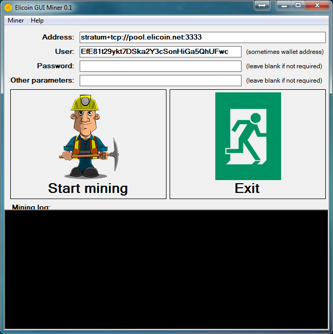

# Elicoin GUI miner
**Elicoin GUI miner** is a graphical user interface for mining [Elicoin](https://elicoin.net) cryptocurrency using **cpuminer-opt**.
This application is written in C# (.NET 2.0) and works under Windows.

## Download
- [Elicoin GUI Miner for Windows](https://github.com/elicoin/elicoin-gui-miner/releases/)

## Screenshot

 

## License
Elicoin GUI Miner is open source software developed under [**MIT license**](./LICENSE).
 
